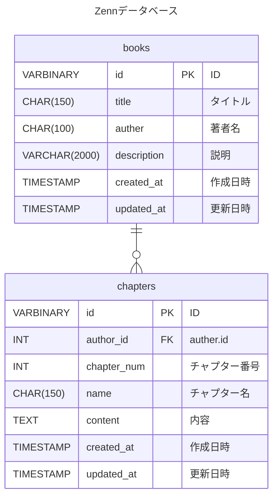

# ER図

```mermaid
---
title: "Zennデータベース"
---
erDiagram
    books ||--o{ chapters : ""

    books {
        VARBINARY id PK "ID"
        CHAR(150) title "タイトル"
        CHAR(100) auther "著者名"
        VARCHAR(2000) description "説明"
        TIMESTAMP created_at "作成日時"
        TIMESTAMP updated_at "更新日時"
    }

    chapters {
        VARBINARY id PK "ID"
        INT author_id FK "auther.id"
        INT chapter_num "チャプター番号"
        CHAR(150) name "チャプター名"
        TEXT content "内容"
        TIMESTAMP created_at "作成日時"
        TIMESTAMP updated_at "更新日時"
    }
```