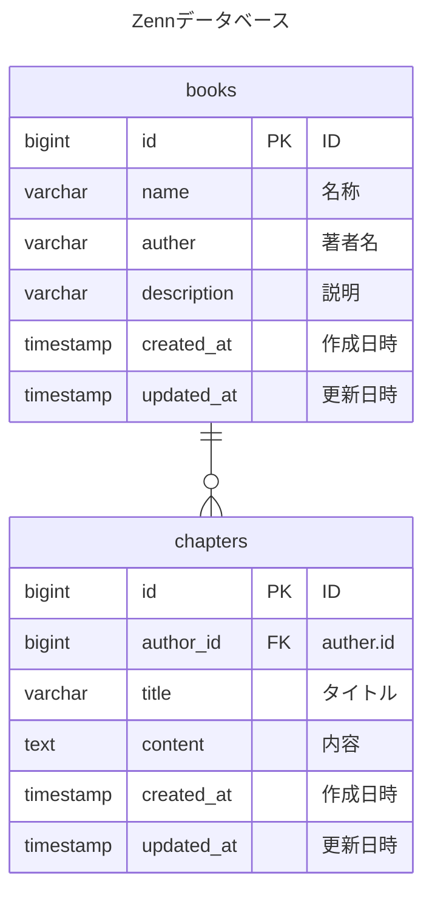

# ER図

```mermaid
---
title: "Zennデータベース"
---
erDiagram
    books ||--o{ chapters : ""

    books {
        bigint id PK "ID"
        varchar name "名称"
        varchar auther "著者名"
        varchar description "説明"
        timestamp created_at "作成日時"
        timestamp updated_at "更新日時"
    }

    chapters {
        bigint id PK "ID"
        bigint author_id FK "auther.id"
        varchar title "タイトル"
        text content "内容"
        timestamp created_at "作成日時"
        timestamp updated_at "更新日時"
    }
```